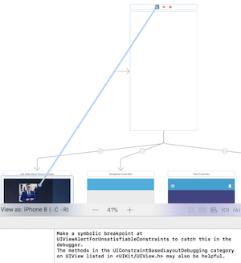

# BMSlideMenu - Slide Menu for iOS(Swift 3)
BMSlideMenu is easy, smooth and efficient slide menu for iOS.


### Integrating

Follow the steps to integrate BMSlideMenu.

Step 1 :- Copy the following files to your project

* SWRevealViewController.h
* SWRevealViewController.m
* BMSlideMenu-Bridging-Header.h

Step 2 :- Storyboard Updations

* Create a view controller a give the class name - SWRevealViewController(Identity Inspector)
* set it as initial view controller(Attributes Inspector)

* Create 3 other view controller(ViewController, LeftSlideMenuViewController, RightSlideMenuViewController)
* Embed ViewController in Navigation Controller(Editor -> Embed In -> Navigation Controller)
* Add left and right Bar Button Item to the MainViewController
* Create segue from the SWRevealViewController to all the 3 view controllers and select

* Click on segue and name Segue Identifier(Attributes Inspector) as "sw_front" for ViewController
* Click on segue and name Segue Identifier(Attributes Inspector) as "sw_rear" for LeftSlideMenuViewController
* Click on segue and name Segue Identifier(Attributes Inspector) as "sw_right" for RighttSlideMenuViewController

 


Step 3 :- Use this code in the ViewController

```
class ViewController: UIViewController {
    
    @IBOutlet weak var menuButton: UIBarButtonItem!
    @IBOutlet weak var alertButton: UIBarButtonItem!

    override func viewDidLoad() {
        super.viewDidLoad()
        self.sideMenu()
    }
    
    func sideMenu() {
        if revealViewController() != nil {
            menuButton.target = revealViewController()
            menuButton.action = #selector(SWRevealViewController.revealToggle(_:))
            revealViewController().rearViewRevealWidth = 275
            revealViewController().rightViewRevealWidth = 160
            
            alertButton.target = revealViewController()
            alertButton.action = #selector(SWRevealViewController.rightRevealToggle(_:))
            view.addGestureRecognizer(self.revealViewController().panGestureRecognizer())
        }
    }
}

```

Step 4 :- Customization

* Customize your view controller and as per the width mention in the ViewController the data will be displayed

## Reference

* [John-Lluch](https://github.com/John-Lluch/SWRevealViewController) - The framework used

## Cheers
